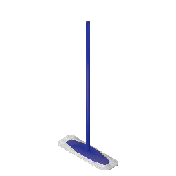

# Actual Mop

Actual Mop adds a... Mop to My Summer Car, which lets you clean the urine stains in your home!

## Requirements

- My Summer Car (newest release)
- [MSCLoader](https://www.nexusmods.com/mysummercar/mods/147)

## Installation

Grab the mod from [NexusMods](https://www.nexusmods.com/mysummercar/mods/163), or [releases page](https://github.com/Athlon007/ActualMop/releases), paste it in MSC Mod Loader Mods folder (ex. C:\SteamApps\common\My Summer Car\Mods) and start the game - that's it!

You can find your mop in the washing machine room (between kitchen and bathroom).

## License

This program is distributed under GNU General Public License v3. Feel free to use its source code as long as you mention the author and state the changes. You can also modify, share and distribute it, as long as you state changes. For more, see [LICENSE](LICENSE.md) file.

## Credits

- [BrennFuchS](https://www.racedepartment.com/downloads/authors/brennfuchs-yt.257537/) - 3D model of the mop
- People at MSC Modding Discord for a help with an anti-drop script

## Support

Like this mod? Consider buying me a beer :)

[PayPal](https://www.paypal.me/figurakonrad)

## Contact

Discord: Athlon#5974
